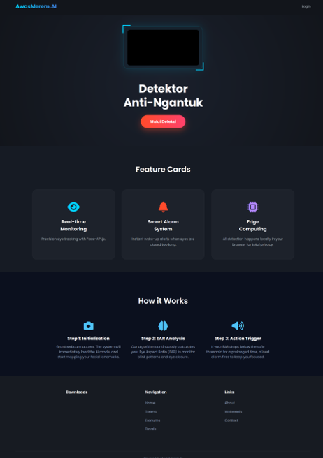

# 👁️ AwasMerem.AI - Real-Time Drowsiness Detector



> **"Don't blink. This AI is watching you."** 
> A lightweight, browser-based AI application designed to prevent you from falling asleep during late-night study sessions or heavy coding marathons. 

---

## 🚀 Overview

**AwasMerem.AI** (from the Indonesian phrase meaning "Beware of Closing Your Eyes") is an interactive, real-time web application that monitors your facial landmarks and eye openness. If the system detects that your eyes have been closed for too long, it will trigger a loud alarm to wake you up immediately. 

Built entirely with frontend web technologies, it requires **zero server-side processing**, ensuring zero latency and maximum user privacy.

## ✨ Key Features

*   🎯 **Real-time Monitoring:** Precision eye tracking using `face-api.js` to map 68 facial landmarks instantly.
*   🚨 **Smart Alarm System:** Calculates the Eye Aspect Ratio (EAR) dynamically. If the EAR drops below the safe threshold, a wake-up audio alert is fired.
*   🔒 **Edge Computing:** All machine learning models and computer vision processes run 100% locally in your browser. No data or video feeds are ever sent to a server.
*   🎨 **Immersive Glassmorphism UI:** Features a modern dark-themed interface, frosted glass effect panels, futuristic neon color palettes, and smooth CSS keyframe animations.

## 🛠️ Tech Stack

This project is built using vanilla web technologies, making it incredibly fast and easy to modify:
*   **HTML5 & CSS3** (Flexbox, Grid, CSS Animations, Backdrop-filter)
*   **Vanilla JavaScript** (ES6+, Intersection Observer API)
*   **Face-API.js** (TensorFlow.js wrapper for face detection and face landmark prediction)
*   **FontAwesome** (Icons) & **Google Fonts** (Poppins)

## ⚙️ How It Works (The Logic)

1.  **Initialization:** The app requests webcam access and pre-loads the lightweight AI models (`tiny_face_detector` and `face_landmark_68`).
2.  **EAR Analysis:** The algorithm continuously calculates the distance between the upper and lower eyelids.
3.  **Action Trigger:** If the calculated EAR falls below `0.25` for a prolonged duration, the system assumes the user is asleep and triggers the HTML5 `<audio>` alarm.

## 💻 How to Run Locally

Due to browser security policies regarding webcam access and CORS, you cannot simply double-click the `index.html` file. You need a local server.

1. Clone this repository:
   ```bash
   git clone [https://github.com/yourusername/awas-merem-ai.git](https://github.com/yourusername/awas-merem-ai.git)
